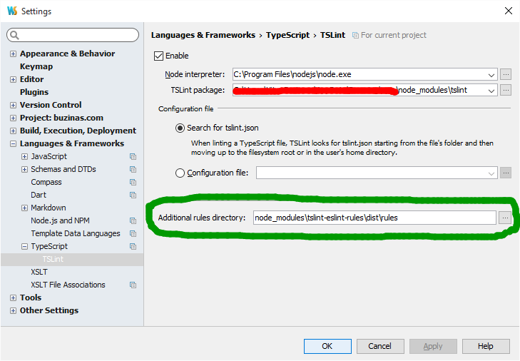
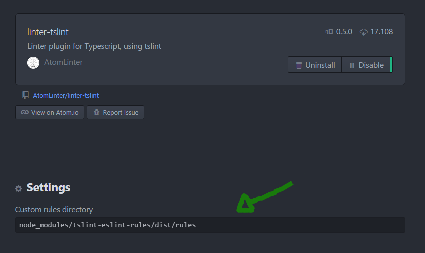

[](https://travis-ci.org/buzinas/tslint-eslint-rules)
[](https://www.npmjs.com/package/tslint-eslint-rules)
[](https://www.npmjs.com/package/tslint-eslint-rules)
[](https://zenhub.io/)
[](https://shields.io/)
[](LICENSE)


# ESLint rules for TSLint

## Improve your TSLint with the missing ESLint Rules

You want to code in TypeScript but miss all the rules available in ESLint?

Now you can combine both worlds by using this TSLint plugin!

*WARN: this project is still under development.*

*You can see what rules were already migrated [in the eslint_tslint.json file](https://github.com/buzinas/tslint-eslint-rules/blob/master/eslint_tslint.json)*


## Usage

### Install from NPM to your Dev Dependencies

```console
npm install --save-dev tslint-eslint-rules
```

### Configure TSLint to use `tslint-eslint-rules` folder:
- #### TSLint configuration file (tsconfig.json) - **RECOMMENDED**

  We contributed to the `palantir/tslint` repository, by adding the option of using the `rulesDirectory` property inside your `tsconfig.json` file, e.g:

  ```json
  {
    "rulesDirectory": "node_modules/tslint-eslint-rules/dist/rules",
    "rules": {
      "no-constant-condition": true
    }
  }
  ```

  You can also pass an array of strings to the `rulesDirectory` property to combine this plugin with other community custom rules.

  The options below, you should only use when not using this one.

- #### TSLint CLI

  ```console
  tslint [file] -r node_modules/tslint-eslint-rules/dist/rules
  ```

- #### TSLint Library ([read more](https://github.com/palantir/tslint#library-1))

  ```javascript
  const options = {
    formatter: "json",
    configuration: configuration,
    rulesDirectory: 'node_modules/tslint-eslint-rules/dist/rules'
    formattersDirectory: ''
  };

  let linter = new Linter(fileName, contents, options);
  let result = linter.lint();
  ```

- #### Gulp (`gulp-tslint`)

  ```javascript
  gulp
    .src(/* [files] */)
    .pipe(tslint({
      rulesDirectory: 'node_modules/tslint-eslint-rules/dist/rules'
    }));
  ```

- #### Grunt (`grunt-tslint`)

  ```javascript
  grunt.initConfig({
    /* other configurations */
    tslint: {
      options: {
        configuration: grunt.file.readJSON('tslint.json'),
        rulesDirectory: 'node_modules/tslint-eslint-rules/dist/rules'
      },
      files: {
        src: [/* [files] */]
      }
    }
  })
  ```

- #### WebStorm

  Open `File > Settings` and follow the example below:

  

- #### Atom (`linter-tslint`)

  We contributed to the `linter-tslint` Atom's plugin, by adding the "Custom rules directory" feature.

  

- ### Sublime Text (`SublimeLinter-contrib-tslint`)

  In your `Packages/User/SublimeLinter.sublime-settings` file, you can configure `tslint` options, similar to the example bellow:

  ```json
  {
    "user": {
      "linters": {
        "tslint": {
          "args": [
             "--r=node_modules/tslint-eslint-rules/dist/rules"
          ]
        }
      }
    }
  }
  ```

### Configure your rules

Then, in your `tslint.json` file, insert the rules as described below.


## Rules (copied from [ESLint website](http://eslint.org/docs/rules/))

The list below shows all the existing ESLint rules and the similar rules available in TSLint.

### Possible Errors

The following rules point out areas where you might have made mistakes.

* [comma-dangle](http://eslint.org/docs/rules/comma-dangle) => trailing-comma (native)
  * Description: disallow or enforce trailing commas (recommended)
  * Usage

    ```json
    "trailing-comma": [
      true,
      {
        "multiline": "never",
        "singleline": "never"
      }
    ]
    ```

* [no-cond-assign](http://eslint.org/docs/rules/no-cond-assign) => no-conditional-assignment (native)
  * Description: disallow assignment in conditional expressions (recommended)
  * Usage

    ```json
    "no-conditional-assignment": true
    ```

* [no-console](http:/eslint.org/docs/rules/no-console) => no-console (native)
  * Description: disallow use of `console` in the node environment (recommended)
  * Usage

    ```json
    "no-console": [
      true,
      "debug",
      "info",
      "time",
      "timeEnd",
      "trace"
    ]
    ```

* [no-constant-condition](http://eslint.org/docs/rules/no-constant-condition) => no-constant-condition (tslint-eslint-rules)
  * Description: disallow use of constant expressions in conditions (recommended)
  * Usage

    ```json
    "no-constant-condition": true
    ```

* [no-control-regex](http://eslint.org/docs/rules/no-control-regex) => no-control-regex (tslint-eslint-rules) [TODO](https://github.com/buzinas/tslint-eslint-rules/issues/5)
  * Description: disallow control characters in regular expressions (recommended)
  * Usage

    ```json
    "no-control-regex": true
    ```

* [no-debugger](http://eslint.org/docs/rules/no-debugger) => no-debugger (native)
  * Description: disallow use of `debugger` (recommended)
  * Usage

    ```json
    "no-debugger": true
    ```

* [no-dupe-args](http://eslint.org/docs/rules/no-dupe-args) => not applicable to TypeScript
  * Description: disallow duplicate arguments in functions (recommended)

* [no-dupe-keys](http://eslint.org/docs/rules/no-dupe-keys) => no-duplicate-key (native)
  * Description: disallow duplicate keys when creating object literals (recommended)
  * Usage

    ```json
    "no-duplicate-key": true
    ```

* [no-duplicate-case](http://eslint.org/docs/rules/no-duplicate-case) => no-duplicate-case (tslint-eslint-rules)
  * Description: disallow a duplicate case label. (recommended)
  * Usage

    ```json
    "no-duplicate-case": true
    ```

* [no-empty-character-class](http://eslint.org/docs/rules/no-empty-character-class) => no-empty-character-class (tslint-eslint-rules) [TODO](https://github.com/buzinas/tslint-eslint-rules/issues/8)
  * Description: disallow the use of empty character classes in regular expressions (recommended)
  * Usage

    ```json
    "no-empty-character-class": true
    ```

* [no-empty](http://eslint.org/docs/rules/no-empty) => no-empty (native)
  * Description: disallow empty statements (recommended)
  * Usage

    ```json
    "no-empty": true
    ```

* [no-ex-assign](http://eslint.org/docs/rules/no-ex-assign) => no-ex-assign (tslint-eslint-rules)
  * Description: disallow assigning to the exception in a `catch` block (recommended)
  * Usage

    ```json
    "no-ex-assign": true
    ```

* [no-extra-boolean-cast](http://eslint.org/docs/rules/no-extra-boolean-cast) => no-extra-boolean-cast (tslint-eslint-rules)
  * Description: disallow double-negation boolean casts in a boolean context (recommended)
  * Usage

    ```json
    "no-extra-boolean-cast": true
    ```

* [no-extra-parens](http://eslint.org/docs/rules/no-extra-parens) => no-extra-parens (tslint-eslint-rules) TODO (low priority)
  * Description: disallow unnecessary parentheses
  * Usage

    ```json
    "no-extra-parens": [
      true,
      "functions"
    ]
    ```

    ```json
    "no-extra-parens": [
      true,
      "all"
    ]
    ```

* [no-extra-semi](http://eslint.org/docs/rules/no-extra-semi) => no-extra-semi (tslint-eslint-rules)
  * Description: disallow unnecessary semicolons (recommended)
  * Usage

    ```json
    "no-extra-semi": true
    ```

* [no-func-assign](http://eslint.org/docs/rules/no-func-assign) => not applicable to TypeScript
  * Description: disallow overwriting functions written as function declarations (recommended)

* [no-inner-declarations](http://eslint.org/docs/rules/no-inner-declarations) => no-inner-declarations (tslint-eslint-rules)
  * Description: disallow function or variable declarations in nested blocks (recommended)
  * Usage

    ```json
    "no-inner-declarations": [
      true,
      "functions"
    ]
    ```

    ```json
    "no-inner-declarations": [
      true,
      "both"
    ]
    ```

* [no-invalid-regexp](http://eslint.org/docs/rules/no-invalid-regexp) => no-invalid-regex (tslint-eslint-rules)
  * Description: disallow invalid regular expression strings in the `RegExp` constructor (recommended)
  * Usage

    ```json
    "no-invalid-regexp": true
    ```

* [no-irregular-whitespace](http://eslint.org/docs/rules/no-irregular-whitespace) => no-irregular-whitespace (tslint-eslint-rules) [TODO](https://github.com/buzinas/tslint-eslint-rules/issues/14)
  * Description: disallow irregular whitespace outside of strings and comments (recommended)
  * Usage

    ```json
    "no-irregular-whitespace": true
    ```

* [no-negated-in-lhs](http://eslint.org/docs/rules/no-negated-in-lhs) => not applicable to TypeScript
  * Description: disallow negation of the left operand of an `in` expression (recommended)

* [no-obj-calls](http://eslint.org/docs/rules/no-obj-calls) => not applicable to TypeScript
  * Description: disallow the use of object properties of the global object (`Math` and `JSON`) as functions (recommended)

* [no-regex-spaces](http://eslint.org/docs/rules/no-regex-spaces) => no-regex-spaces (tslint-eslint-rules)
  * Description: disallow multiple spaces in a regular expression literal (recommended)
  * Usage

    ```json
    "no-regex-spaces": true
    ```

* [no-sparse-arrays](http://eslint.org/docs/rules/no-sparse-arrays) => no-sparse-arrays (tslint-eslint-rules)
  * Description: disallow sparse arrays (recommended)
  * Usage

    ```json
    "no-sparse-arrays": true
    ```

* [no-unexpected-multiline](http://eslint.org/docs/rules/no-unexpected-multiline) => no-unexpected-multiline (tslint-eslint-rules)
  * Description: Avoid code that looks like two expressions but is actually one
  * Usage

    ```json
    "no-unexpected-multiline": true
    ```

* [no-unreachable](http://eslint.org/docs/rules/no-unreachable) => no-unreachable (native)
  * Description: disallow unreachable statements after a return, throw, continue, or break statement (recommended)
  * Usage

    ```json
    "no-unreachable": true
    ```

* [use-isnan](http://eslint.org/docs/rules/use-isnan) => use-isnan (tslint-eslint-rules)
  * Description: disallow comparisons with the value `NaN` (recommended)
  * Usage

    ```json
    "use-isnan": true
    ```

* [valid-jsdoc](http://eslint.org/docs/rules/valid-jsdoc) => valid-jsdoc (tslint-eslint-rules) [TODO](https://github.com/buzinas/tslint-eslint-rules/issues/21)
  * Description: Ensure JSDoc comments are valid
  * Usage

    ```json
    "valid-jsdoc": [
      true,
      {
        "prefer": {
          "return": "returns"
        },
        "requireReturn": false,
        "requireParamDescription": true,
        "requireReturnDescription": true,
        "matchDescription": "^[A-Z][A-Za-z0-9\\s]*[.]$"
      }
    ]
    ```

* [valid-typeof](http://eslint.org/docs/rules/valid-typeof) => valid-typeof (tslint-eslint-rules)
  * Description: Ensure that the results of typeof are compared against a valid string (recommended)
  * Usage

    ```json
    "valid-typeof": true
    ```

### Best Practices

These are rules designed to prevent you from making mistakes. They either prescribe a better way of doing something or help you avoid footguns.

* [accessor-pairs](http://eslint.org/docs/rules/accessor-pairs) =>
  * Description: Enforces getter/setter pairs in objects
  * Usage

    ```json
    "accessor-pairs": [
        true,
        {

        }
      ]
    ```
* [block-scoped-var](http://eslint.org/docs/rules/block-scoped-var) =>
  * Description: treat `var` statements as if they were block scoped
  * Usage

    ```json
    "block-scoped-var": [
        true,
        {

        }
      ]
    ```
* [complexity](http://eslint.org/docs/rules/complexity) =>
  * Description: specify the maximum cyclomatic complexity allowed in a program
  * Usage

    ```json
    "complexity": [
        true,
        {

        }
      ]
    ```
* [consistent-return](http://eslint.org/docs/rules/consistent-return) =>
  * Description: require `return` statements to either always or never specify values
  * Usage

    ```json
    "consistent-return": [
        true,
        {

        }
      ]
    ```
* [curly](http://eslint.org/docs/rules/curly) =>
  * Description: specify curly brace conventions for all control statements
  * Usage

    ```json
    "curly": [
        true,
        {

        }
      ]
    ```
* [default-case](http://eslint.org/docs/rules/default-case) =>
  * Description: require `default` case in `switch` statements
  * Usage

    ```json
    "default-case": [
        true,
        {

        }
      ]
    ```
* [dot-location](http://eslint.org/docs/rules/dot-location) =>
  * Description: enforces consistent newlines before or after dots
  * Usage

    ```json
    "dot-location": [
        true,
        {

        }
      ]
    ```
* [dot-notation](http://eslint.org/docs/rules/dot-notation) =>
  * Description: encourages use of dot notation whenever possible
  * Usage

    ```json
    "dot-notation": [
        true,
        {

        }
      ]
    ```
* [eqeqeq](http://eslint.org/docs/rules/eqeqeq) =>
  * Description: require the use of `===` and `!==`
  * Usage

    ```json
    "eqeqeq": [
        true,
        {

        }
      ]
    ```
* [guard-for-in](http://eslint.org/docs/rules/guard-for-in) =>
  * Description: make sure `for-in` loops have an `if` statement
  * Usage

    ```json
    "guard-for-in": [
        true,
        {

        }
      ]
    ```
* [no-alert](http://eslint.org/docs/rules/no-alert) =>
  * Description: disallow the use of `alert`, `confirm`, and `prompt`
  * Usage

    ```json
    "no-alert": [
        true,
        {

        }
      ]
    ```
* [no-caller](http://eslint.org/docs/rules/no-caller) =>
  * Description: disallow use of `arguments.caller` or `arguments.callee`
  * Usage

    ```json
    "no-caller": [
        true,
        {

        }
      ]
    ```
* [no-case-declarations](http://eslint.org/docs/rules/no-case-declarations) =>
  * Description: disallow lexical declarations in case clauses
  * Usage

    ```json
    "no-case-declarations": [
        true,
        {

        }
      ]
    ```
* [no-div-regex](http://eslint.org/docs/rules/no-div-regex) =>
  * Description: disallow division operators explicitly at beginning of regular expression
  * Usage

    ```json
    "no-div-regex": [
        true,
        {

        }
      ]
    ```
* [no-else-return](http://eslint.org/docs/rules/no-else-return) =>
  * Description: disallow `else` after a `return` in an `if`
  * Usage

    ```json
    "no-else-return": [
        true,
        {

        }
      ]
    ```
* [no-empty-label](http://eslint.org/docs/rules/no-empty-label) =>
  * Description: disallow use of labels for anything other than loops and switches
  * Usage

    ```json
    "no-empty-label": [
        true,
        {

        }
      ]
    ```
* [no-empty-pattern](http://eslint.org/docs/rules/no-empty-pattern) =>
  * Description: disallow use of empty destructuring patterns
  * Usage

    ```json
    "no-empty-pattern": [
        true,
        {

        }
      ]
    ```
* [no-eq-null](http://eslint.org/docs/rules/no-eq-null) =>
  * Description: disallow comparisons to null without a type-checking operator
  * Usage

    ```json
    "no-eq-null": [
        true,
        {

        }
      ]
    ```
* [no-eval](http://eslint.org/docs/rules/no-eval) =>
  * Description: disallow use of `eval()`
  * Usage

    ```json
    "no-eval": [
        true,
        {

        }
      ]
    ```
* [no-extend-native](http://eslint.org/docs/rules/no-extend-native) =>
  * Description: disallow adding to native types
  * Usage

    ```json
    "no-extend-native": [
        true,
        {

        }
      ]
    ```
* [no-extra-bind](http://eslint.org/docs/rules/no-extra-bind) =>
  * Description: disallow unnecessary function binding
  * Usage

    ```json
    "no-extra-bind": [
        true,
        {

        }
      ]
    ```
* [no-fallthrough](http://eslint.org/docs/rules/no-fallthrough) =>
  * Description: disallow fallthrough of `case` statements (recommended)
  * Usage

    ```json
    "no-fallthrough": [
        true,
        {

        }
      ]
    ```
* [no-floating-decimal](http://eslint.org/docs/rules/no-floating-decimal) =>
  * Description: disallow the use of leading or trailing decimal points in numeric literals
  * Usage

    ```json
    "no-floating-decimal": [
        true,
        {

        }
      ]
    ```
* [no-implicit-coercion](http://eslint.org/docs/rules/no-implicit-coercion) =>
  * Description: disallow the type conversions with shorter notations
  * Usage

    ```json
    "no-implicit-coercion": [
        true,
        {

        }
      ]
    ```
* [no-implied-eval](http://eslint.org/docs/rules/no-implied-eval) =>
  * Description: disallow use of `eval()`-like methods
  * Usage

    ```json
    "no-implied-eval": [
        true,
        {

        }
      ]
    ```
* [no-invalid-this](http://eslint.org/docs/rules/no-invalid-this) =>
  * Description: disallow `this` keywords outside of classes or class-like objects
  * Usage

    ```json
    "no-invalid-this": [
        true,
        {

        }
      ]
    ```
* [no-iterator](http://eslint.org/docs/rules/no-iterator) =>
  * Description: disallow Usage
 of `__iterator__` property
  * Usage

    ```json
    "no-iterator": [
        true,
        {

        }
      ]
    ```
* [no-labels](http://eslint.org/docs/rules/no-labels) =>
  * Description: disallow use of labeled statements
  * Usage

    ```json
    "no-labels": [
        true,
        {

        }
      ]
    ```
* [no-lone-blocks](http://eslint.org/docs/rules/no-lone-blocks) =>
  * Description: disallow unnecessary nested blocks
  * Usage

    ```json
    "no-lone-blocks": [
        true,
        {

        }
      ]
    ```
* [no-loop-func](http://eslint.org/docs/rules/no-loop-func) =>
  * Description: disallow creation of functions within loops
  * Usage

    ```json
    "no-loop-func": [
        true,
        {

        }
      ]
    ```
* [no-magic-numbers](http://eslint.org/docs/rules/no-magic-numbers) =>
  * Description: disallow the use of magic numbers
  * Usage

    ```json
    "no-magic-numbers": [
        true,
        {

        }
      ]
    ```
* [no-multi-spaces](http://eslint.org/docs/rules/no-multi-spaces) =>
  * Description: disallow use of multiple spaces
  * Usage

    ```json
    "no-multi-spaces": [
        true,
        {

        }
      ]
    ```
* [no-multi-str](http://eslint.org/docs/rules/no-multi-str) =>
  * Description: disallow use of multiline strings
  * Usage

    ```json
    "no-multi-str": [
        true,
        {

        }
      ]
    ```
* [no-native-reassign](http://eslint.org/docs/rules/no-native-reassign) =>
  * Description: disallow reassignments of native objects
  * Usage

    ```json
    "no-native-reassign": [
        true,
        {

        }
      ]
    ```
* [no-new-func](http://eslint.org/docs/rules/no-new-func) =>
  * Description: disallow use of new operator for `Function` object
  * Usage

    ```json
    "no-new-func": [
        true,
        {

        }
      ]
    ```
* [no-new-wrappers](http://eslint.org/docs/rules/no-new-wrappers) =>
  * Description: disallows creating new instances of `String`,`Number`, and `Boolean`
  * Usage

    ```json
    "no-new-wrappers": [
        true,
        {

        }
      ]
    ```
* [no-new](http://eslint.org/docs/rules/no-new) =>
  * Description: disallow use of the `new` operator when not part of an assignment or comparison
  * Usage

    ```json
    "no-new": [
        true,
        {

        }
      ]
    ```
* [no-octal-escape](http://eslint.org/docs/rules/no-octal-escape) =>
  * Description: disallow use of octal escape sequences in string literals, such as `var foo = "Copyright \251";`
  * Usage

    ```json
    "no-octal-escape": [
        true,
        {

        }
      ]
    ```
* [no-octal](http://eslint.org/docs/rules/no-octal) =>
  * Description: disallow use of octal literals (recommended)
  * Usage

    ```json
    "no-octal": [
        true,
        {

        }
      ]
    ```
* [no-param-reassign](http://eslint.org/docs/rules/no-param-reassign) =>
  * Description: disallow reassignment of function parameters
  * Usage

    ```json
    "no-param-reassign": [
        true,
        {

        }
      ]
    ```
* [no-process-env](http://eslint.org/docs/rules/no-process-env) =>
  * Description: disallow use of `process.env`
  * Usage

    ```json
    "no-process-env": [
        true,
        {

        }
      ]
    ```
* [no-proto](http://eslint.org/docs/rules/no-proto) =>
  * Description: disallow Usage
 of `__proto__` property
  * Usage

    ```json
    "no-proto": [
        true,
        {

        }
      ]
    ```
* [no-redeclare](http://eslint.org/docs/rules/no-redeclare) =>
  * Description: disallow declaring the same variable more than once (http://eslint.org/docs/rules/recommended)
  * Usage

    ```json
    "no-redeclare": [
        true,
        {

        }
      ]
    ```
* [no-return-assign](http://eslint.org/docs/rules/no-return-assign) =>
  * Description: disallow use of assignment in `return` statement
  * Usage

    ```json
    "no-return-assign": [
        true,
        {

        }
      ]
    ```
* [no-script-url](http://eslint.org/docs/rules/no-script-url) =>
  * Description: disallow use of `javascript:` urls.
  * Usage

    ```json
    "no-script-url": [
        true,
        {

        }
      ]
    ```
* [no-self-compare](http://eslint.org/docs/rules/no-self-compare) =>
  * Description: disallow comparisons where both sides are exactly the same
  * Usage

    ```json
    "no-self-compare": [
        true,
        {

        }
      ]
    ```
* [no-sequences](http://eslint.org/docs/rules/no-sequences) =>
  * Description: disallow use of the comma operator
  * Usage

    ```json
    "no-sequences": [
        true,
        {

        }
      ]
    ```
* [no-throw-literal](http://eslint.org/docs/rules/no-throw-literal) =>
  * Description: restrict what can be thrown as an exception
  * Usage

    ```json
    "no-throw-literal": [
        true,
        {

        }
      ]
    ```
* [no-unused-expressions](http://eslint.org/docs/rules/no-unused-expressions) =>
  * Description: disallow Usage
 of expressions in statement position
  * Usage

    ```json
    "no-unused-expressions": [
        true,
        {

        }
      ]
    ```
* [no-useless-call](http://eslint.org/docs/rules/no-useless-call) =>
  * Description: disallow unnecessary `.call()` and `.apply()`
  * Usage

    ```json
    "no-useless-call": [
        true,
        {

        }
      ]
    ```
* [no-useless-concat](http://eslint.org/docs/rules/no-useless-concat) =>
  * Description: disallow unnecessary concatenation of literals or template literals
  * Usage

    ```json
    "no-useless-concat": [
        true,
        {

        }
      ]
    ```
* [no-void](http://eslint.org/docs/rules/no-void) =>
  * Description: disallow use of the `void` operator
  * Usage

    ```json
    "no-void": [
        true,
        {

        }
      ]
    ```
* [no-warning-comments](http://eslint.org/docs/rules/no-warning-comments) - disallow Usage
 of configurable warning terms in comments =>
  * Description: e.g. `TODO` or `FIXME`
  * Usage

    ```json
    "no-warning-comments": [
        true,
        {

        }
      ]
    ```
* [no-with](http://eslint.org/docs/rules/no-with) =>
  * Description: disallow use of the `with` statement
  * Usage

    ```json
    "no-with": [
        true,
        {

        }
      ]
    ```
* [radix](http://eslint.org/docs/rules/radix) =>
  * Description: require use of the second argument for `parseInt()`
  * Usage

    ```json
    "radix": [
        true,
        {

        }
      ]
    ```
* [vars-on-top](http://eslint.org/docs/rules/vars-on-top) =>
  * Description: require declaration of all vars at the top of their containing scope
  * Usage

    ```json
    "vars-on-top": [
        true,
        {

        }
      ]
    ```
* [wrap-iife](http://eslint.org/docs/rules/wrap-iife) =>
  * Description: require immediate function invocation to be wrapped in parentheses
  * Usage

    ```json
    "wrap-iife": [
        true,
        {

        }
      ]
    ```
* [yoda](http://eslint.org/docs/rules/yoda) =>
  * Description: require or disallow Yoda conditions
  * Usage

    ```json
    "yoda": [
        true,
        {

        }
      ]
    ```

### Strict Mode

These rules relate to using strict mode.

* [strict](http://eslint.org/docs/rules/strict) =>
  * Description: controls location of Use Strict Directives
  * Usage

    ```json
    "strict": [
        true,
        {

        }
      ]
    ```

### Variables

These rules have to do with variable declarations.

* [init-declarations](http://eslint.org/docs/rules/init-declarations) =>
  * Description: enforce or disallow variable initializations at definition
  * Usage

    ```json
    "init-declarations": [
        true,
        {

        }
      ]
    ```
* [no-catch-shadow](http://eslint.org/docs/rules/no-catch-shadow) =>
  * Description: disallow the catch clause parameter name being the same as a variable in the outer scope
  * Usage

    ```json
    "no-catch-shadow": [
        true,
        {

        }
      ]
    ```
* [no-delete-var](http://eslint.org/docs/rules/no-delete-var) =>
  * Description: disallow deletion of variables (recommended)
  * Usage

    ```json
    "no-delete-var": [
        true,
        {

        }
      ]
    ```
* [no-label-var](http://eslint.org/docs/rules/no-label-var) =>
  * Description: disallow labels that share a name with a variable
  * Usage

    ```json
    "no-label-var": [
        true,
        {

        }
      ]
    ```
* [no-shadow-restricted-names](http://eslint.org/docs/rules/no-shadow-restricted-names) =>
  * Description: disallow shadowing of names such as `arguments`
  * Usage

    ```json
    "no-shadow-restricted-names": [
        true,
        {

        }
      ]
    ```
* [no-shadow](http://eslint.org/docs/rules/no-shadow) =>
  * Description: disallow declaration of variables already declared in the outer scope
  * Usage

    ```json
    "no-shadow": [
        true,
        {

        }
      ]
    ```
* [no-undef-init](http://eslint.org/docs/rules/no-undef-init) =>
  * Description: disallow use of undefined when initializing variables
  * Usage

    ```json
    "no-undef-init": [
        true,
        {

        }
      ]
    ```
* [no-undef](http://eslint.org/docs/rules/no-undef) =>
  * Description: disallow use of undeclared variables unless mentioned in a `/*global */` block (recommended)
  * Usage

    ```json
    "no-undef": [
        true,
        {

        }
      ]
    ```
* [no-undefined](http://eslint.org/docs/rules/no-undefined) =>
  * Description: disallow use of `undefined` variable
  * Usage

    ```json
    "no-undefined": [
        true,
        {

        }
      ]
    ```
* [no-unused-vars](http://eslint.org/docs/rules/no-unused-vars) =>
  * Description: disallow declaration of variables that are not used in the code (recommended)
  * Usage

    ```json
    "no-unused-vars": [
        true,
        {

        }
      ]
    ```
* [no-use-before-define](http://eslint.org/docs/rules/no-use-before-define) =>
  * Description: disallow use of variables before they are defined
  * Usage

    ```json
    "no-use-before-define": [
        true,
        {

        }
      ]
    ```

### Node.js and CommonJS

These rules are specific to JavaScript running on Node.js or using CommonJS in the browser.

* [callback-return](http://eslint.org/docs/rules/callback-return) =>
  * Description: enforce `return` after a callback
  * Usage

    ```json
    "callback-return": [
        true,
        {

        }
      ]
    ```
* [global-require](http://eslint.org/docs/rules/global-require) =>
  * Description: enforce `require()` on top-level module scope
  * Usage

    ```json
    "global-require": [
        true,
        {

        }
      ]
    ```
* [handle-callback-err](http://eslint.org/docs/rules/handle-callback-err) =>
  * Description: enforce error handling in callbacks
  * Usage

    ```json
    "handle-callback-err": [
        true,
        {

        }
      ]
    ```
* [no-mixed-requires](http://eslint.org/docs/rules/no-mixed-requires) =>
  * Description: disallow mixing regular variable and require declarations
  * Usage

    ```json
    "no-mixed-requires": [
        true,
        {

        }
      ]
    ```
* [no-new-require](http://eslint.org/docs/rules/no-new-require) =>
  * Description: disallow use of `new` operator with the `require` function
  * Usage

    ```json
    "no-new-require": [
        true,
        {

        }
      ]
    ```
* [no-path-concat](http://eslint.org/docs/rules/no-path-concat) =>
  * Description: disallow string concatenation with `__dirname` and `__filename`
  * Usage

    ```json
    "no-path-concat": [
        true,
        {

        }
      ]
    ```
* [no-process-exit](http://eslint.org/docs/rules/no-process-exit) =>
  * Description: disallow `process.exit()`
  * Usage

    ```json
    "no-process-exit": [
        true,
        {

        }
      ]
    ```
* [no-restricted-modules](http://eslint.org/docs/rules/no-restricted-modules) =>
  * Description: restrict Usage
 of specified node modules
  * Usage

    ```json
    "no-restricted-modules": [
        true,
        {

        }
      ]
    ```
* [no-sync](http://eslint.org/docs/rules/no-sync) =>
  * Description: disallow use of synchronous methods
  * Usage

    ```json
    "no-sync": [
        true,
        {

        }
      ]
    ```

### Stylistic Issues

These rules are purely matters of style and are quite subjective.

* [array-bracket-spacing](http://eslint.org/docs/rules/array-bracket-spacing) =>
  * Description: enforce spacing inside array brackets
  * Usage

    ```json
    "array-bracket-spacing": [
        true,
        {

        }
      ]
    ```
* [block-spacing](http://eslint.org/docs/rules/block-spacing) =>
  * Description: disallow or enforce spaces inside of single line blocks
  * Usage

    ```json
    "block-spacing": [
        true,
        {

        }
      ]
    ```
* [brace-style](http://eslint.org/docs/rules/brace-style) =>
  * Description: enforce one true brace style
  * Usage

    ```json
    "brace-style": [
        true,
        {

        }
      ]
    ```
* [camelcase](http://eslint.org/docs/rules/camelcase) =>
  * Description: require camel case names
  * Usage

    ```json
    "camelcase": [
        true,
        {

        }
      ]
    ```
* [comma-spacing](http://eslint.org/docs/rules/comma-spacing) =>
  * Description: enforce spacing before and after comma
  * Usage

    ```json
    "comma-spacing": [
        true,
        {

        }
      ]
    ```
* [comma-style](http://eslint.org/docs/rules/comma-style) =>
  * Description: enforce one true comma style
  * Usage

    ```json
    "comma-style": [
        true,
        {

        }
      ]
    ```
* [computed-property-spacing](http://eslint.org/docs/rules/computed-property-spacing) =>
  * Description: require or disallow padding inside computed properties
  * Usage

    ```json
    "computed-property-spacing": [
        true,
        {

        }
      ]
    ```
* [consistent-this](http://eslint.org/docs/rules/consistent-this) =>
  * Description: enforce consistent naming when capturing the current execution context
  * Usage

    ```json
    "consistent-this": [
        true,
        {

        }
      ]
    ```
* [eol-last](http://eslint.org/docs/rules/eol-last) =>
  * Description: enforce newline at the end of file, with no multiple empty lines
  * Usage

    ```json
    "eol-last": [
        true,
        {

        }
      ]
    ```
* [func-names](http://eslint.org/docs/rules/func-names) =>
  * Description: require function expressions to have a name
  * Usage

    ```json
    "func-names": [
        true,
        {

        }
      ]
    ```
* [func-style](http://eslint.org/docs/rules/func-style) =>
  * Description: enforce use of function declarations or expressions
  * Usage

    ```json
    "func-style": [
        true,
        {

        }
      ]
    ```
* [id-length](http://eslint.org/docs/rules/id-length) =>
  * Description: this option enforces minimum and maximum identifier lengths (variable names, property names etc.)
  * Usage

    ```json
    "id-length": [
        true,
        {

        }
      ]
    ```
* [id-match](http://eslint.org/docs/rules/id-match) =>
  * Description: require identifiers to match the provided regular expression
  * Usage

    ```json
    "id-match": [
        true,
        {

        }
      ]
    ```
* [indent](http://eslint.org/docs/rules/indent) =>
  * Description: specify tab or space width for your code
  * Usage

    ```json
    "indent": [
        true,
        {

        }
      ]
    ```
* [jsx-quotes](http://eslint.org/docs/rules/jsx-quotes) =>
  * Description: specify whether double or single quotes should be used in JSX attributes
  * Usage

    ```json
    "jsx-quotes": [
        true,
        {

        }
      ]
    ```
* [key-spacing](http://eslint.org/docs/rules/key-spacing) =>
  * Description: enforce spacing between keys and values in object literal properties
  * Usage

    ```json
    "key-spacing": [
        true,
        {

        }
      ]
    ```
* [linebreak-style](http://eslint.org/docs/rules/linebreak-style) =>
  * Description: disallow mixed 'LF' and 'CRLF' as linebreaks
  * Usage

    ```json
    "linebreak-style": [
        true,
        {

        }
      ]
    ```
* [lines-around-comment](http://eslint.org/docs/rules/lines-around-comment) =>
  * Description: enforce empty lines around comments
  * Usage

    ```json
    "lines-around-comment": [
        true,
        {

        }
      ]
    ```
* [max-nested-callbacks](http://eslint.org/docs/rules/max-nested-callbacks) =>
  * Description: specify the maximum depth callbacks can be nested
  * Usage

    ```json
    "max-nested-callbacks": [
        true,
        {

        }
      ]
    ```
* [new-cap](http://eslint.org/docs/rules/new-cap) =>
  * Description: require a capital letter for constructors
  * Usage

    ```json
    "new-cap": [
        true,
        {

        }
      ]
    ```
* [new-parens](http://eslint.org/docs/rules/new-parens) =>
  * Description: disallow the omission of parentheses when invoking a constructor with no arguments
  * Usage

    ```json
    "new-parens": [
        true,
        {

        }
      ]
    ```
* [newline-after-var](http://eslint.org/docs/rules/newline-after-var) =>
  * Description: require or disallow an empty newline after variable declarations
  * Usage

    ```json
    "newline-after-var": [
        true,
        {

        }
      ]
    ```
* [no-array-constructor](http://eslint.org/docs/rules/no-array-constructor) =>
  * Description: disallow use of the `Array` constructor
  * Usage

    ```json
    "no-array-constructor": [
        true,
        {

        }
      ]
    ```
* [no-continue](http://eslint.org/docs/rules/no-continue) =>
  * Description: disallow use of the `continue` statement
  * Usage

    ```json
    "no-continue": [
        true,
        {

        }
      ]
    ```
* [no-inline-comments](http://eslint.org/docs/rules/no-inline-comments) =>
  * Description: disallow comments inline after code
  * Usage

    ```json
    "no-inline-comments": [
        true,
        {

        }
      ]
    ```
* [no-lonely-if](http://eslint.org/docs/rules/no-lonely-if) =>
  * Description: disallow `if` as the only statement in an `else` block
  * Usage

    ```json
    "no-lonely-if": [
        true,
        {

        }
      ]
    ```
* [no-mixed-spaces-and-tabs](http://eslint.org/docs/rules/no-mixed-spaces-and-tabs) =>
  * Description: disallow mixed spaces and tabs for indentation (recommended)
  * Usage

    ```json
    "no-mixed-spaces-and-tabs": [
        true,
        {

        }
      ]
    ```
* [no-multiple-empty-lines](http://eslint.org/docs/rules/no-multiple-empty-lines) =>
  * Description: disallow multiple empty lines
  * Usage

    ```json
    "no-multiple-empty-lines": [
        true,
        {

        }
      ]
    ```
* [no-negated-condition](http://eslint.org/docs/rules/no-negated-condition) =>
  * Description: disallow negated conditions
  * Usage

    ```json
    "no-negated-condition": [
        true,
        {

        }
      ]
    ```
* [no-nested-ternary](http://eslint.org/docs/rules/no-nested-ternary) =>
  * Description: disallow nested ternary expressions
  * Usage

    ```json
    "no-nested-ternary": [
        true,
        {

        }
      ]
    ```
* [no-new-object](http://eslint.org/docs/rules/no-new-object) =>
  * Description: disallow the use of the `Object` constructor
  * Usage

    ```json
    "no-new-object": [
        true,
        {

        }
      ]
    ```
* [no-restricted-syntax](http://eslint.org/docs/rules/no-restricted-syntax) =>
  * Description: disallow use of certain syntax in code
  * Usage

    ```json
    "no-restricted-syntax": [
        true,
        {

        }
      ]
    ```
* [no-spaced-func](http://eslint.org/docs/rules/no-spaced-func) =>
  * Description: disallow space between function identifier and application
  * Usage

    ```json
    "no-spaced-func": [
        true,
        {

        }
      ]
    ```
* [no-ternary](http://eslint.org/docs/rules/no-ternary) =>
  * Description: disallow the use of ternary operators
  * Usage

    ```json
    "no-ternary": [
        true,
        {

        }
      ]
    ```
* [no-trailing-spaces](http://eslint.org/docs/rules/no-trailing-spaces) =>
  * Description: disallow trailing whitespace at the end of lines
  * Usage

    ```json
    "no-trailing-spaces": [
        true,
        {

        }
      ]
    ```
* [no-underscore-dangle](http://eslint.org/docs/rules/no-underscore-dangle) =>
  * Description: disallow dangling underscores in identifiers
  * Usage

    ```json
    "no-underscore-dangle": [
        true,
        {

        }
      ]
    ```
* [no-unneeded-ternary](http://eslint.org/docs/rules/no-unneeded-ternary) =>
  * Description: disallow the use of ternary operators when a simpler alternative exists
  * Usage

    ```json
    "no-unneeded-ternary": [
        true,
        {

        }
      ]
    ```
* [object-curly-spacing](http://eslint.org/docs/rules/object-curly-spacing) =>
  * Description: require or disallow padding inside curly braces
  * Usage

    ```json
    "object-curly-spacing": [
        true,
        {

        }
      ]
    ```
* [one-var](http://eslint.org/docs/rules/one-var) =>
  * Description: require or disallow one variable declaration per function
  * Usage

    ```json
    "one-var": [
        true,
        {

        }
      ]
    ```
* [operator-assignment](http://eslint.org/docs/rules/operator-assignment) =>
  * Description: require assignment operator shorthand where possible or prohibit it entirely
  * Usage

    ```json
    "operator-assignment": [
        true,
        {

        }
      ]
    ```
* [operator-linebreak](http://eslint.org/docs/rules/operator-linebreak) =>
  * Description: enforce operators to be placed before or after line breaks
  * Usage

    ```json
    "operator-linebreak": [
        true,
        {

        }
      ]
    ```
* [padded-blocks](http://eslint.org/docs/rules/padded-blocks) =>
  * Description: enforce padding within blocks
  * Usage

    ```json
    "padded-blocks": [
        true,
        {

        }
      ]
    ```
* [quote-props](http://eslint.org/docs/rules/quote-props) =>
  * Description: require quotes around object literal property names
  * Usage

    ```json
    "quote-props": [
        true,
        {

        }
      ]
    ```
* [quotes](http://eslint.org/docs/rules/quotes) =>
  * Description: specify whether backticks, double or single quotes should be used
  * Usage

    ```json
    "quotes": [
        true,
        {

        }
      ]
    ```
* [require-jsdoc](http://eslint.org/docs/rules/require-jsdoc) =>
  * Description: Require JSDoc comment
  * Usage

    ```json
    "require-jsdoc": [
        true,
        {

        }
      ]
    ```
* [semi-spacing](http://eslint.org/docs/rules/semi-spacing) =>
  * Description: enforce spacing before and after semicolons
  * Usage

    ```json
    "semi-spacing": [
        true,
        {

        }
      ]
    ```
* [semi](http://eslint.org/docs/rules/semi) =>
  * Description: require or disallow use of semicolons instead of ASI
  * Usage

    ```json
    "semi": [
        true,
        {

        }
      ]
    ```
* [sort-vars](http://eslint.org/docs/rules/sort-vars) =>
  * Description: sort variables within the same declaration block
  * Usage

    ```json
    "sort-vars": [
        true,
        {

        }
      ]
    ```
* [space-after-keywords](http://eslint.org/docs/rules/space-after-keywords) =>
  * Description: require a space after certain keywords
  * Usage

    ```json
    "space-after-keywords": [
        true,
        {

        }
      ]
    ```
* [space-before-blocks](http://eslint.org/docs/rules/space-before-blocks) =>
  * Description: require or disallow a space before blocks
  * Usage

    ```json
    "space-before-blocks": [
        true,
        {

        }
      ]
    ```
* [space-before-function-paren](http://eslint.org/docs/rules/space-before-function-paren) =>
  * Description: require or disallow a space before function opening parenthesis
  * Usage

    ```json
    "space-before-function-paren": [
        true,
        {

        }
      ]
    ```
* [space-before-keywords](http://eslint.org/docs/rules/space-before-keywords) =>
  * Description: require a space before certain keywords
  * Usage

    ```json
    "space-before-keywords": [
        true,
        {

        }
      ]
    ```
* [space-in-parens](http://eslint.org/docs/rules/space-in-parens) =>
  * Description: require or disallow spaces inside parentheses
  * Usage

    ```json
    "space-in-parens": [
        true,
        {

        }
      ]
    ```
* [space-infix-ops](http://eslint.org/docs/rules/space-infix-ops) =>
  * Description: require spaces around operators
  * Usage

    ```json
    "space-infix-ops": [
        true,
        {

        }
      ]
    ```
* [space-return-throw-case](http://eslint.org/docs/rules/space-return-throw-case) =>
  * Description: require a space after `return`, `throw`, and `case`
  * Usage

    ```json
    "space-return-throw-case": [
        true,
        {

        }
      ]
    ```
* [space-unary-ops](http://eslint.org/docs/rules/space-unary-ops) =>
  * Description: require or disallow spaces before/after unary operators
  * Usage

    ```json
    "space-unary-ops": [
        true,
        {

        }
      ]
    ```
* [spaced-comment](http://eslint.org/docs/rules/spaced-comment) =>
  * Description: require or disallow a space immediately following the `//` or `/*` in a comment
  * Usage

    ```json
    "spaced-comment": [
        true,
        {

        }
      ]
    ```
* [wrap-regex](http://eslint.org/docs/rules/wrap-regex) =>
  * Description: require regex literals to be wrapped in parentheses
  * Usage

    ```json
    "wrap-regex": [
        true,
        {

        }
      ]
    ```

### ECMAScript 6

These rules are only relevant to ES6 environments.

* [arrow-body-style](http://eslint.org/docs/rules/arrow-body-style) =>
  * Description: require braces in arrow function body
  * Usage

    ```json
    "arrow-body-style": [
        true,
        {

        }
      ]
    ```
* [arrow-parens](http://eslint.org/docs/rules/arrow-parens) =>
  * Description: require parens in arrow function arguments
  * Usage

    ```json
    "arrow-parens": [
        true,
        {

        }
      ]
    ```
* [arrow-spacing](http://eslint.org/docs/rules/arrow-spacing) =>
  * Description: require space before/after arrow function's arrow
  * Usage

    ```json
    "arrow-spacing": [
        true,
        {

        }
      ]
    ```
* [constructor-super](http://eslint.org/docs/rules/constructor-super) =>
  * Description: verify calls of `super()` in constructors
  * Usage

    ```json
    "constructor-super": [
        true,
        {

        }
      ]
    ```
* [generator-star-spacing](http://eslint.org/docs/rules/generator-star-spacing) =>
  * Description: enforce spacing around the `*` in generator functions
  * Usage

    ```json
    "generator-star-spacing": [
        true,
        {

        }
      ]
    ```
* [no-arrow-condition](http://eslint.org/docs/rules/no-arrow-condition) =>
  * Description: disallow arrow functions where a condition is expected
  * Usage

    ```json
    "no-arrow-condition": [
        true,
        {

        }
      ]
    ```
* [no-class-assign](http://eslint.org/docs/rules/no-class-assign) =>
  * Description: disallow modifying variables of class declarations
  * Usage

    ```json
    "no-class-assign": [
        true,
        {

        }
      ]
    ```
* [no-const-assign](http://eslint.org/docs/rules/no-const-assign) =>
  * Description: disallow modifying variables that are declared using `const`
  * Usage

    ```json
    "no-const-assign": [
        true,
        {

        }
      ]
    ```
* [no-dupe-class-members](http://eslint.org/docs/rules/no-dupe-class-members) =>
  * Description: disallow duplicate name in class members
  * Usage

    ```json
    "no-dupe-class-members": [
        true,
        {

        }
      ]
    ```
* [no-this-before-super](http://eslint.org/docs/rules/no-this-before-super) =>
  * Description: disallow use of `this`/`super` before calling `super()` in constructors.
  * Usage

    ```json
    "no-this-before-super": [
        true,
        {

        }
      ]
    ```
* [no-var](http://eslint.org/docs/rules/no-var) =>
  * Description: require `let` or `const` instead of `var`
  * Usage

    ```json
    "no-var": [
        true,
        {

        }
      ]
    ```
* [object-shorthand](http://eslint.org/docs/rules/object-shorthand) =>
  * Description: require method and property shorthand syntax for object literals
  * Usage

    ```json
    "object-shorthand": [
        true,
        {

        }
      ]
    ```
* [prefer-arrow-callback](http://eslint.org/docs/rules/prefer-arrow-callback) =>
  * Description: suggest using arrow functions as callbacks
  * Usage

    ```json
    "prefer-arrow-callback": [
        true,
        {

        }
      ]
    ```
* [prefer-const](http://eslint.org/docs/rules/prefer-const) =>
  * Description: suggest using `const` declaration for variables that are never modified after declared
  * Usage

    ```json
    "prefer-const": [
        true,
        {

        }
      ]
    ```
* [prefer-reflect](http://eslint.org/docs/rules/prefer-reflect) =>
  * Description: suggest using Reflect methods where applicable
  * Usage

    ```json
    "prefer-reflect": [
        true,
        {

        }
      ]
    ```
* [prefer-spread](http://eslint.org/docs/rules/prefer-spread) =>
  * Description: suggest using the spread operator instead of `.apply()`.
  * Usage

    ```json
    "prefer-spread": [
        true,
        {

        }
      ]
    ```
* [prefer-template](http://eslint.org/docs/rules/prefer-template) =>
  * Description: suggest using template literals instead of strings concatenation
  * Usage

    ```json
    "prefer-template": [
        true,
        {

        }
      ]
    ```
* [require-yield](http://eslint.org/docs/rules/require-yield) =>
  * Description: disallow generator functions that do not have `yield`
  * Usage

    ```json
    "require-yield": [
        true,
        {

        }
      ]
    ```

### Legacy

The following rules are included for compatibility with [JSHint](http://jshint.com/) and [JSLint](http://jslint.com/). While the names of the rules may not match up with the JSHint/JSLint counterpart, the functionality is the same.

* [max-depth](http://eslint.org/docs/rules/max-depth) =>
  * Description: specify the maximum depth that blocks can be nested
  * Usage

    ```json
    "max-depth": [
        true,
        {

        }
      ]
    ```
* [max-len](http://eslint.org/docs/rules/max-len) =>
  * Description: specify the maximum length of a line in your program
  * Usage

    ```json
    "max-len": [
        true,
        {

        }
      ]
    ```
* [max-params](http://eslint.org/docs/rules/max-params) =>
  * Description: limits the number of parameters that can be used in the function declaration.
  * Usage

    ```json
    "max-params": [
        true,
        {

        }
      ]
    ```
* [max-statements](http://eslint.org/docs/rules/max-statements) =>
  * Description: specify the maximum number of statement allowed in a function
  * Usage

    ```json
    "max-statements": [
        true,
        {

        }
      ]
    ```
* [no-bitwise](http://eslint.org/docs/rules/no-bitwise) =>
  * Description: disallow use of bitwise operators
  * Usage

    ```json
    "no-bitwise": [
        true,
        {

        }
      ]
    ```
* [no-plusplus](http://eslint.org/docs/rules/no-plusplus) =>
  * Description: disallow use of unary operators, `++` and `--`
  * Usage

    ```json
    "no-plusplus": [
        true,
        {

        }
      ]
    ```


## Contributing

Bugs, rules requests, doubts etc., open a Github Issue.

If you didn't find the rule, you can also create an ESLint custom rule for TSLint:

- Open an issue asking for the rule
- Fork this repository
- Create a branch with the rule name, e.g: no-if-usage
- Run `npm install`
- Run `gulp` to run the tests and watch for file changes
- Create your rule tests at `./src/test/rules` and your rule in `./src/rules` with the convetion:
  - Name: rule-name (hyphenated, e.g: no-if-usage)
  - File: ruleNameRule.ts (camelCased and with the `Rule` suffix, e.g: noIfUsageRule.ts)
  - Test File: ruleNameRuleTests.ts (camelCased and with the `RuleTests` suffix, e.g: noIfUsageRuleTests.ts)
- Check if all the tests are passing
- Commit the changes to your repo with the following convention:
  - Example: `[feat] added use-isnan rule (closes #20)`
- Finally, open a Pull Request

You can also contribute with PRs for fixing bugs, or improving documentation, performance. The commit convention for these are, respectively:
- Example: `[bug] fixed no-constant-condition rule (closes #9)`
- Example: `[docs] improved README.md file (closes #32)`
- Example: `[perf] improved valid-typeof rule (closes #48)`


## LICENSE

MIT
